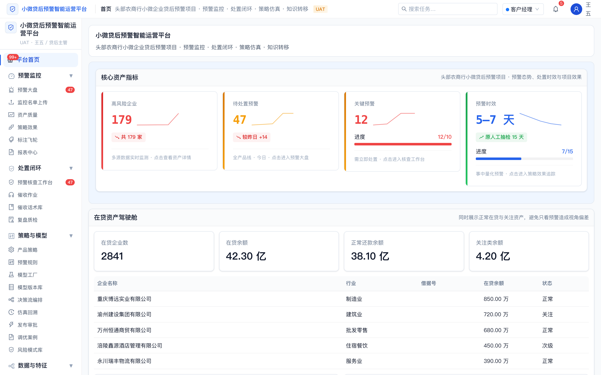
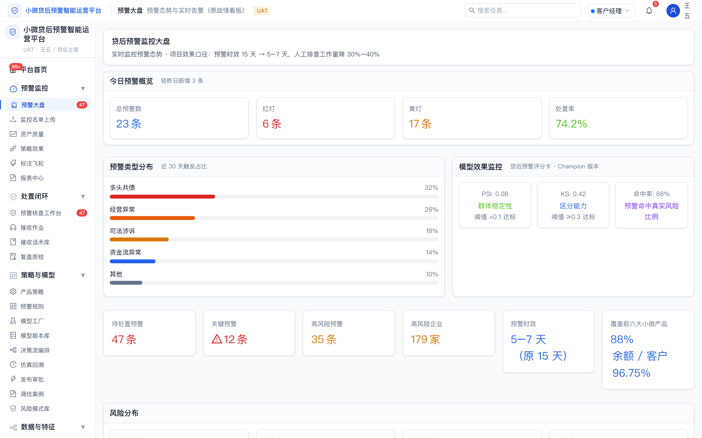
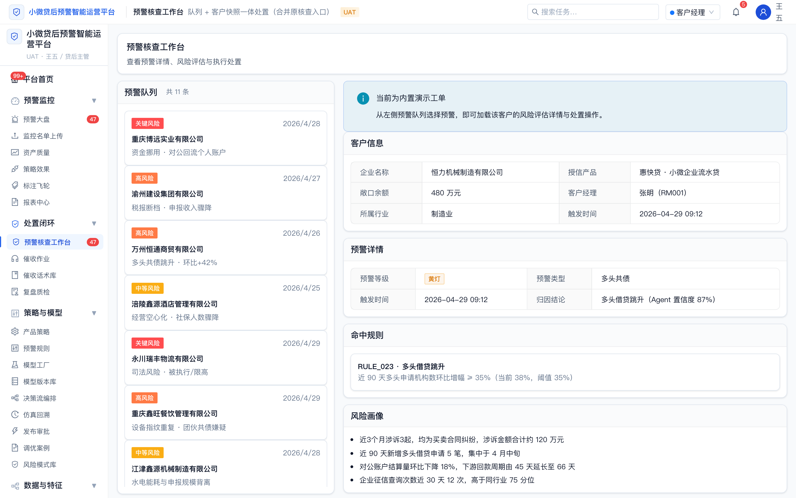
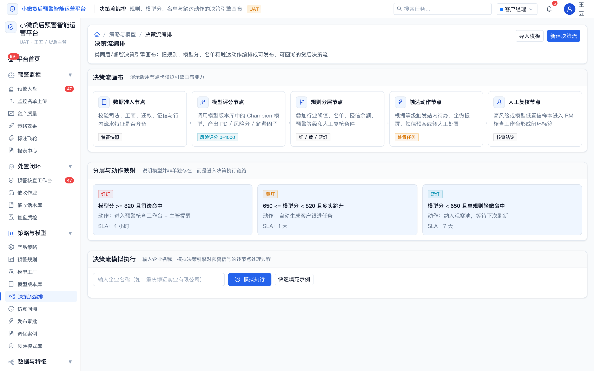
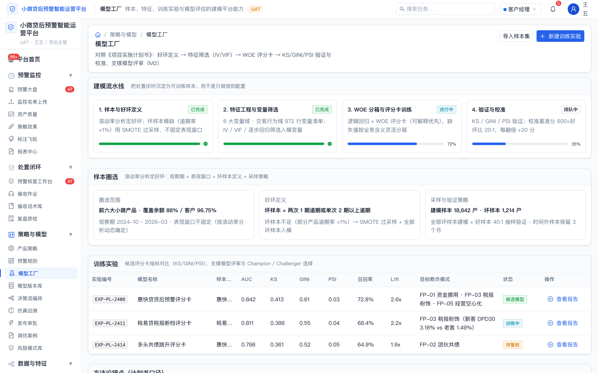
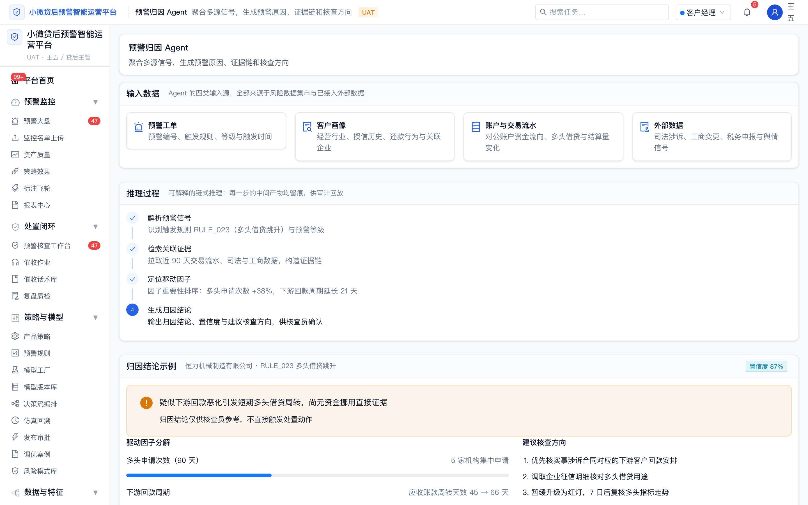
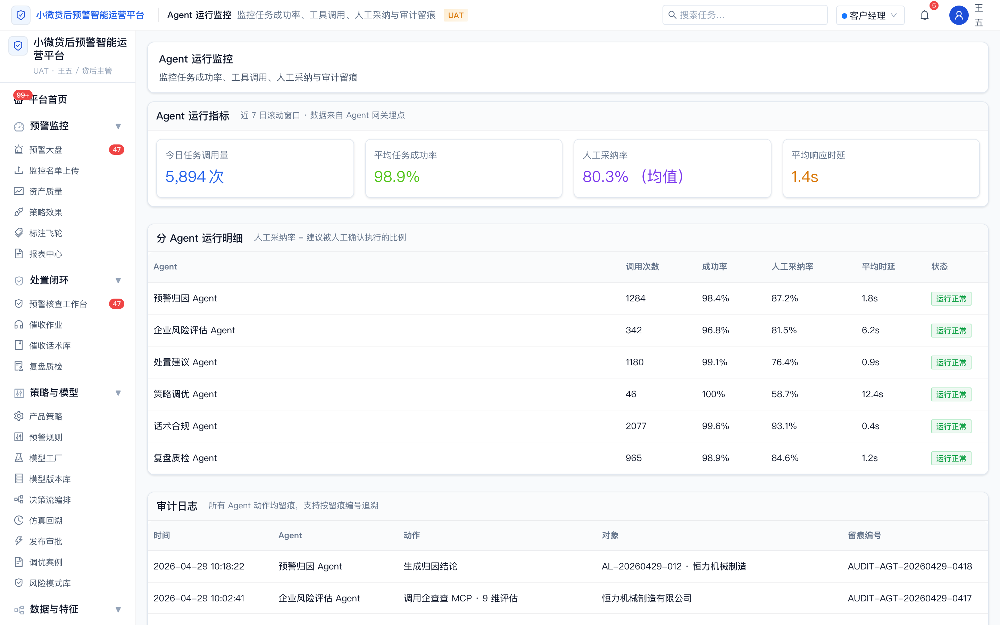
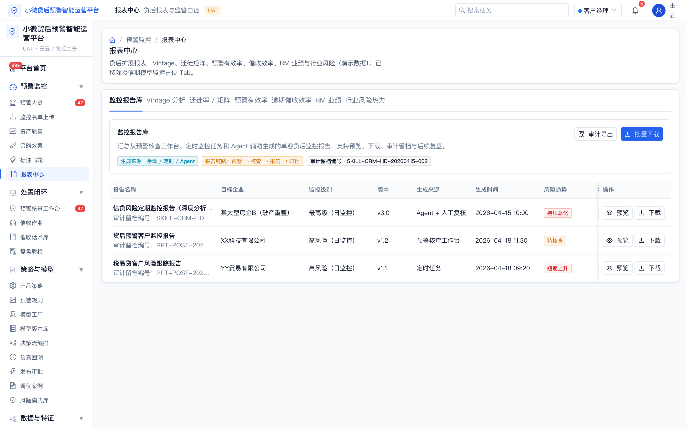
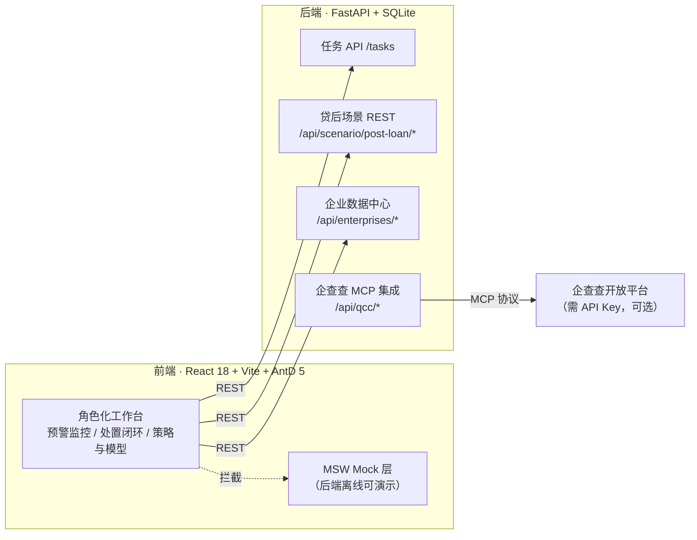

# RIS OS · 风控管理 OS

[](https://github.com/minfushen/ris-os)
[](https://github.com/minfushen/ris-os/tree/scenario/post-loan)
[](https://github.com/minfushen/ris-os/actions/workflows/ci.yml)
[](./LICENSE)

面向信贷全生命周期的 **风控工作台（Risk Intelligence System OS）** 前后端原型。本仓库 **`scenario/post-loan`（贷后场景）** 分支在导航、页面与接口上对齐 **贷后预警与处置**；产品展示名为 **贷后风险智能运营平台**（副标题：预警监控 · 处置闭环 · 策略仿真 · 智能体协同）。前端为「浅色金融玻璃台」骨架（Browser 路径路由），后端为 FastAPI 最小可运行 API，便于本地演示与二次开发。

> 口径说明：本项目为**脱敏演示案例**，客户名统一以"头部农商行"指代，项目编号为演示编号，数据均为虚构演示数据。

**远程仓库：** [https://github.com/minfushen/ris-os](https://github.com/minfushen/ris-os)

---

## 项目截图

| 客户经理首页（角色化工作台） | 贷后预警监控大盘 |
|---|---|
|  |  |

| 预警核查工作台 | 决策流编排 |
|---|---|
|  |  |

| 模型工厂 | 预警归因 Agent |
|---|---|
|  |  |

| Agent 运行监控 | 报表中心（监控报告库） |
|---|---|
|  |  |

---

## 快速演示路径（面试 / 走查 5 分钟）

1. 打开首页 → 顶部**角色切换器**切换「客户经理 / 风控建模师 / 策略审批员」，观察首页内容与侧栏菜单联动；
2. 「预警监控 → 贷后预警监控大盘」看预警态势、模型效果（PSI / KS / 命中率）与待处置队列；
3. 「处置闭环 → 预警核查工作台」走一条"命中规则 → 风险画像 → 处置操作 → 生成监控报告"的处置链路；
4. 「策略与模型 → 模型工厂 / 决策流编排」看评分卡实验与决策引擎画布；
5. 「智能体协同 → 预警归因 Agent / Agent 运行监控」看多 Agent 协同与审计留痕。

未启动后端时前端通过 MSW Mock 仍可完整演示（名单上传、报表中心等少数页面依赖后端）。

---

## 系统架构



---

## 系统集成与闭环设计

> 本节为应用内「演示讲解」页（`/architecture/integration`）的内容迁移，方便面试官在 README 中直接阅读设计说明。

**系统集成三层结构**：信贷系统（客户 / 贷款 / 贷后管理、客户经理工作台）→ 风控建模平台（特征工程、规则引擎、模型引擎、决策服务、监控预警、处置工作台）→ 底座服务（数据仓库、决策引擎、消息服务），层间以 HTTP API 集成。

**数据流向六步链路**：

1. **外部数据源**：征信 / 工商 / 司法 / 税务 / 行为数据；
2. **数据仓库**：行内业务数据与外部数据统一落仓，沉淀变量库；
3. **特征宽表**：按产品线加工还款、涉诉、征信、工商、税务特征；
4. **离线训练 / 在线决策**：离线产出模型版本，在线执行规则 + 模型联合决策；
5. **预警结果**：生成红灯 / 黄灯预警，进入监控大盘和处置队列；
6. **信贷系统**：预警展示、客户经理认领、处置反馈、规则优化回流。

**三个核心设计亮点**：

- **监控驱动迭代**——监控不只是看数，而是触发规则和模型迭代：规则命中率持续下降说明规则可能失效，变量 PSI 偏高则优先排查数据源与样本分布；
- **处置闭环设计**——预警不是终点，处置才是：预警推送 → 客户经理认领 → 处置操作 → 结果反馈 → 规则优化，处置结论反哺样本池与调优案例；
- **多渠道预警触达**——红灯实时触达、黄灯批量触达，站内信 / 企业微信 / 短信三通道分层设计，避免信息过载并保证高风险及时处理。

**P2 暂缓能力边界**（主动说明原型不做的事）：真实短信 / 企微 / 站内信推送、真实决策引擎 / 模型引擎联调、完整后端持久化流程、权限 / 审批 / 审计日志等生产级能力——这些在真实项目按上文「生产化路径」落地。

---

## 贷后场景分支说明（`scenario/post-loan`）

| 项 | 说明 |
|----|------|
| **分支名** | `scenario/post-loan` |
| **与主线** | 自 `main` 同一起点延伸，可独立演进；合并回 `main` 前建议走 PR 评审 |
| **前端入口** | Browser 路径路由：`http://localhost:5173/`（例：`/monitor/dashboard`、`/risk/workbench`、`/reports`） |
| **后端默认** | `http://127.0.0.1:8000`（与 `frontend/.env.development` 中 `VITE_API_BASE_URL` 一致） |
| **贷后 REST** | 前端调用 **`/api/scenario/post-loan/*`**（后端同时挂载无前缀 `/scenario/post-loan/*`，便于兼容旧网关） |

拉取并切换到本分支：

```bash
git fetch origin
git switch scenario/post-loan
```

---

## 功能概览（贷后分支）

| 模块 | 说明 |
|------|------|
| **指挥台首页** | **按角色差异化展示**（客户经理/风控建模师/策略审批员），贷后核心 KPI、处置队列、预警探照灯与快捷入口；**在贷资产驾驶舱**（状态结构占比、客户经理资产分布、经理维度趋势） |
| **角色化演示系统** | **顶部角色切换器**（张明·客户经理 / 张三·风控建模师 / 王五·策略审批员），**侧栏菜单按角色过滤**，**DemoFlowNav 按角色分流**，首页内容联动切换 |
| **预警监控** | 资产质量看板、预警探照灯、策略效果追踪、**报表中心**（含**监控报告库** Tab）、标注飞轮 |
| **名单入池与建档** | 新增**监控名单上传**，支持 CSV 模板下载、批量导入、入池前额度预检、批量风险评估 |
| **处置闭环** | 预警核查工作台（含**监控报告**生成/预览/下载/审计留档）、催收作业（M1/M2/M3 分池）、复盘与质检，**与策略模块双向关联**（FP/RC 引用体系） |
| **策略与模型** | 产品线策略集、规则配置、**模型工厂**（实验管理）、**模型版本库**（Champion/Challenger）、**决策流编排**、**仿真回溯**、发布审批与护栏 |
| **知识沉淀** | 话术库、规则调优案例、风险模式库，**FP（欺诈模式）/ RC（调优案例）跨模块引用** |
| **智能体协同** | 预警归因 / 处置建议 / 策略调优 / 复盘质检 / **企业风险评估（企查查 MCP）** / Agent 运行监控（人工采纳率 + 审计日志） |
| **特征与数据** | **贷后特征工作室**、**数据源管理**，数据来自 **`GET /api/scenario/post-loan/*`** |
| **统一 Mock 层** | MSW (Mock Service Worker) 浏览器端拦截，18 个散落 mock 文件统一收敛为单一数据源，后端离线可完整演示 |
| **任务流（通用）** | `POST /tasks/analysis`、`POST /tasks/review`、`GET /tasks` 等 |

更多接口见 **[backend/README.md](./backend/README.md)**。

---

## Git 分支（场景延伸）

| 场景 | 分支名 |
|------|--------|
| 贷前 | `scenario/pre-loan` |
| 贷中 | `scenario/in-loan` |
| **贷后** | **`scenario/post-loan`**（当前文档默认描述对象） |

---

## 技术栈

| 层级 | 技术 |
|------|------|
| 前端 | React 18、TypeScript、Vite 6、React Router 6、Ant Design 5、Tailwind CSS v4、Zustand |
| 后端 | Python 3、FastAPI、SQLite（开发） |

---

## 技术选型说明：原型 vs 生产化路径

**为什么原型后端用 Python（而不是银行生产系统常见的 Java）？** 本仓库的定位是**产品原型**——一份"可点击的需求文档"，用最短路径验证角色化工作台、处置闭环与策略仿真的产品设计是否成立。评分卡建模（WOE/IV/SMOTE/KS/PSI）与智能体（MCP/LLM）生态均在 Python，原型与模型工程同构，单人全栈交付成本最低。

**真实项目落地时**，按《项目实施计划书》口径：模型经 PMML/ONNX 服务化后部署到**行方既有决策引擎**（我方为集成方，不替换行方系统），业务系统对接走行方 Java 技术栈。两者是"验证设计 → 工程落地"的接力关系，而非同一套代码直接上生产：

| 原型实现（本仓库） | 生产落地（真实项目） | 对应交付物 |
|---|---|---|
| FastAPI 同步 API + SQLite | 行方 Java 技术栈 / 微服务；队列异步化、鉴权、审计 | 《策略及模型 IT 开发部署需求书》 |
| 评分卡指标为前端演示数据 | Python 建模产线训练，模型导出 PMML/ONNX 服务化，灰度发布 + 一键回滚 | 《模型开发及验证报告》、部署与回滚预案 |
| 决策流编排画布（页面演示） | 策略编排落在**行方既有决策引擎**，我方负责变量取数口径与字段映射 | 《IT 开发部署需求书》、字段映射表 |
| 特征与指标写死在 mock/常量 | 风险数据集市 + 特征平台；上线前历史回放比对 + PSI 监控治理一致性 | 《风险数据集市设计方案》 |
| MSW 浏览器端 Mock | 真实网关联调；SIT / UAT / 历史数据批量验证 | 集成 / 验收 / 批量验证测试报告 |
| 页面内演示监控报告 | 对接行内报表平台，报告库 + 审计留档 | 《贷后预警监控方案》 |

---

## 仓库结构

```text
.
├── backend/              FastAPI：任务 API + 贷后场景 REST（scenario_post_loan）
├── frontend/             Vite + React 工作台与模块路由
├── docs/                 信息架构清单、视觉与规格说明等
├── sampledata/           示例数据（含 `post-loan/watchlist-demo-2rows.csv`）
└── 线框图原型/            产品方向说明
```

---

## 环境要求

- **Node.js** ≥ 18（推荐 20+）
- **Python** ≥ 3.10
- **npm** 或 **pnpm** / **yarn**（文档以 npm 为例）

---

## 快速开始

### 1. 克隆并切换到贷后分支

```bash
git clone https://github.com/minfushen/ris-os.git
cd ris-os
git fetch origin
git switch scenario/post-loan
```

若使用 SSH：

```bash
git clone git@github.com:minfushen/ris-os.git
cd ris-os && git switch scenario/post-loan
```

### 2. 启动后端（默认端口 8000）

```bash
cd backend
python3 -m venv .venv
source .venv/bin/activate   # Windows: .venv\Scripts\activate
pip install -r requirements.txt
uvicorn app:app --reload --host 127.0.0.1 --port 8000
```

**验证贷后接口：**

```bash
curl -s http://127.0.0.1:8000/api/scenario/post-loan/feature-studio | head -c 200
```

### 3. 启动前端（默认 Vite 5173）

```bash
cd frontend
npm install
npm run dev
```

浏览器访问：**http://localhost:5173/**（路径路由，直接打开子路径亦可）

### 4. 前端环境变量

- 开发环境使用 **`frontend/.env.development`**，默认 `VITE_API_BASE_URL=http://127.0.0.1:8000`。
- **不要将 `VITE_API_BASE_URL` 设为空字符串**：否则请求会发到 Vite 同源路径，易返回 404（界面提示「资源不存在」）。
- Vite 已配置 **`/api` → 127.0.0.1:8000** 的开发代理；若改为同源相对路径访问 `/api`，开发时亦可转发到后端。

---

## 常用脚本（前端）

| 命令 | 说明 |
|------|------|
| `npm run dev` | 开发服务器 |
| `npm run build` | 类型检查 + 生产构建 |
| `npm run test` | Vitest 单测 |
| `npm run preview` | 预览构建产物 |

---

## 🆕 企业风险评估 Agent（企查查 MCP 集成）

### 功能特性

- ✅ **9 维度风险评估**：基础 6 维 + 供应链特有 3 维
- ✅ **18 类风险排查**：CRITICAL/HIGH/MEDIUM/LOW 四级分类
- ✅ **结构化证据链**：数据来源、更新时间、可信度
- ✅ **处置建议生成**：响应时间、责任人、行动清单
- ✅ **企查查 MCP 实时数据**：评估链路统一走 `qcc-risk` 服务
- ✅ **动态进度展示**：实时推理过程可视化

### 访问地址

```
http://localhost:5173/agents/vendor-risk-assessment
```

### API 端点

```
POST /api/qcc/assess-vendor-risk    # 企业风险评估
GET  /api/qcc/company/{name}        # 获取企业工商信息
GET  /api/qcc/risk/{name}           # 获取企业风险信息
GET  /api/qcc/operation/{name}      # 获取企业经营信息
GET  /api/qcc/health                # 健康检查
```

### 配置要求

在 `backend/.env` 文件中配置企查查 API Key（该文件已被 `.gitignore` 忽略，不会入库）：

```bash
QCC_MCP_API_KEY=your_api_key_here
QCC_MCP_BASE_URL=https://agent.qcc.com/mcp
```

> **未配置 Key 时服务仍可正常启动**，仅企查查相关接口在调用时返回明确提示，其余功能不受影响。

### 设计文档

- [PRD-企业风险评估Agent.md](./docs/prd/PRD-企业风险评估Agent.md)
- [架构设计-企业风险评估Agent.md](./docs/architecture/架构设计-企业风险评估Agent.md)
- [技术方案-企查查MCP集成.md](./docs/technical/技术方案-企查查MCP集成.md)
- [API文档-企业风险评估.md](./docs/api/API文档-企业风险评估.md)
- [用户手册-企业风险评估Agent.md](./docs/user-guide/用户手册-企业风险评估Agent.md)

---

## 文档索引

1. [后端 API 说明（含贷后 REST）](./backend/README.md)
2. [线框图原型](./线框图原型)
3. [首页信息架构改版建议清单](./docs/首页信息架构改版建议清单.md)
4. [新首页 / 全局导航骨架视觉设计方案](./docs/superpowers/specs/2026-04-17-home-navigation-tailwind-glass-design.md)（若路径存在）
5. [PRD-小微贷后预警平台](./docs/prd/PRD-小微贷后预警平台.md)（对齐《项目实施计划书》+ 开源项目借鉴）

---

## 推送到本仓库（维护者）

在已配置 [GitHub 认证](https://docs.github.com/en/get-started/getting-started-with-git/about-remote-repositories) 的机器上：

```bash
git remote add origin https://github.com/minfushen/ris-os.git
git push -u origin scenario/post-loan
```

若远程已初始化且需强推（慎用）：

```bash
git push -u origin scenario/post-loan --force
```

---

## 说明

- 后端任务处理为**同步**最小闭环，无独立 worker；生产化需自行扩展队列、鉴权与审计。
- 贷后「特征工作室」「数据源管理」页依赖上述 **REST**；任务列表等仍使用原有 `/tasks` 接口。若后端未启动或端口不一致，前端会提示连接错误。
- 部分页面仍为演示数据或占位交互，便于产品走查与对接真实网关。

---

## License

本项目以 [MIT License](./LICENSE) 开源。
